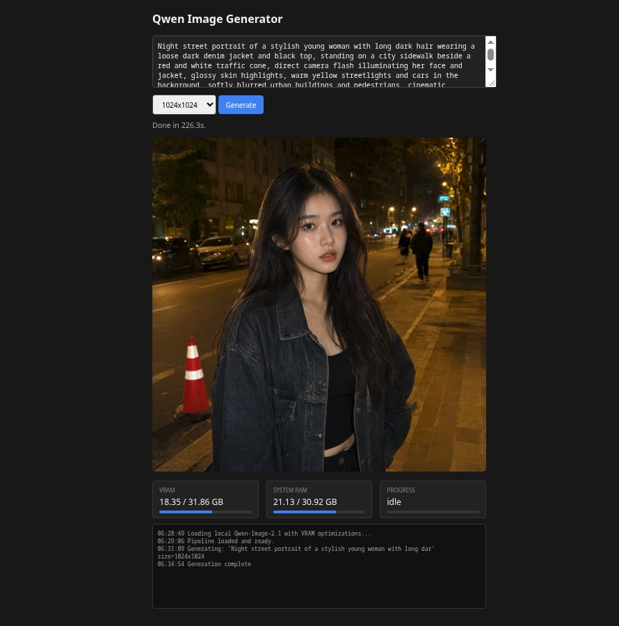
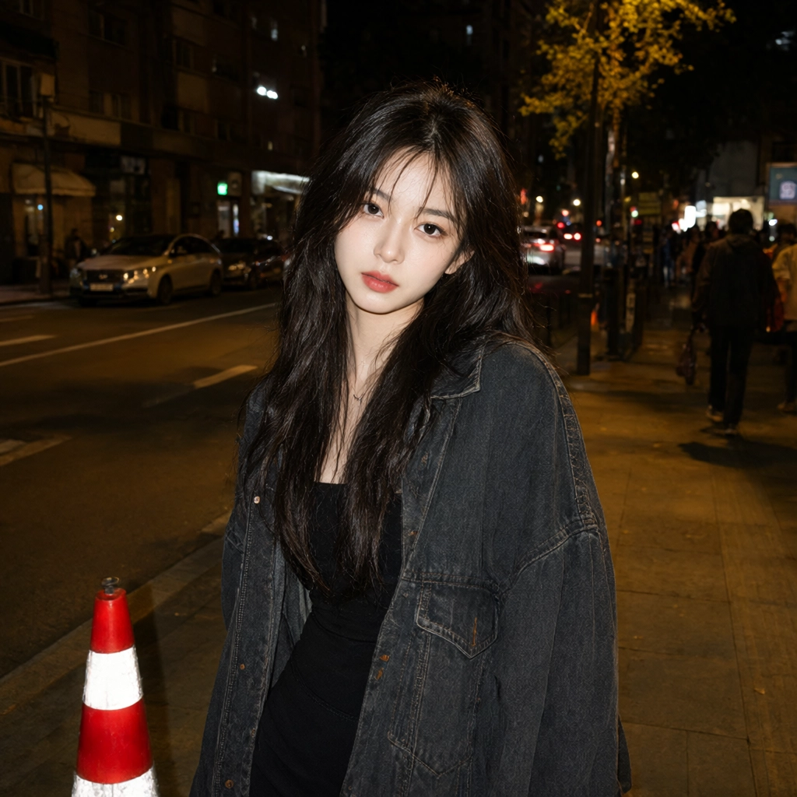
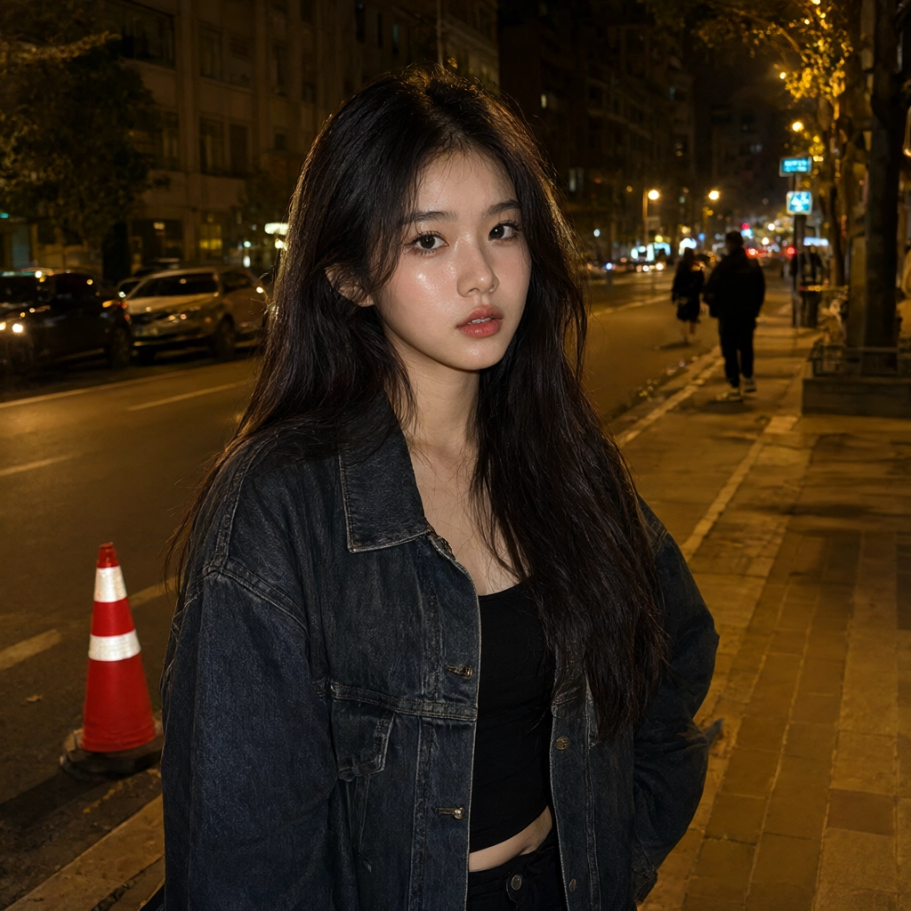
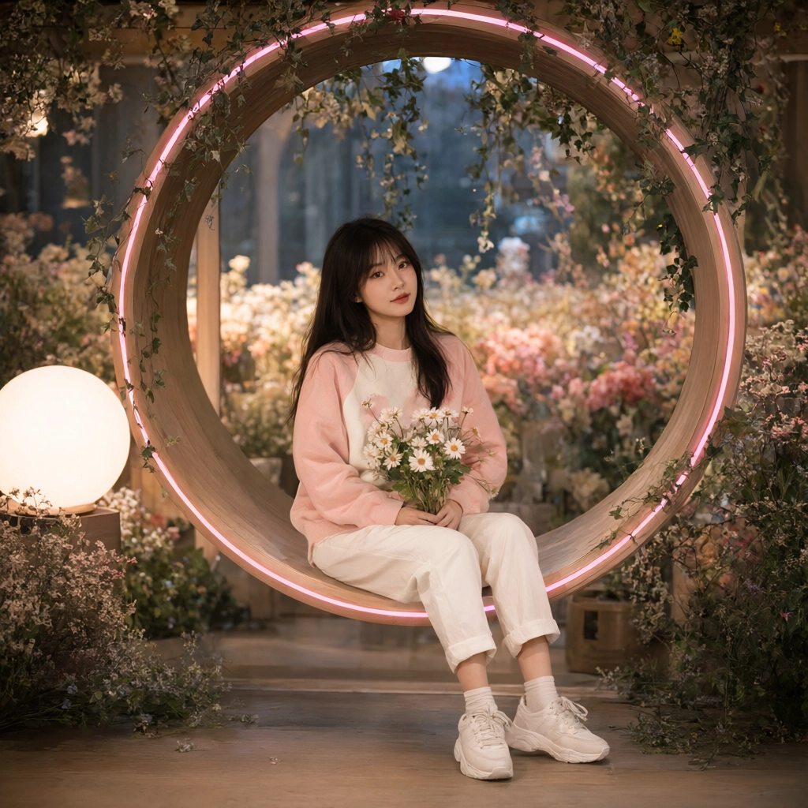

# Qwen Image API

A self-hosted image generation API powered by Qwen-Image-2.1, running on AMD ROCm
(tested on an AMD Radeon AI PRO R9700, 32GB VRAM). Exposes an OpenAI-compatible
`/v1/images/generations` endpoint, plus a minimal web UI for prompting without curl.

## Architecture

```
┌─────────────────┐      ┌──────────────────────┐
│  qwen-image-ui  │      │   qwen-image-api     │
│  (nginx, :3000) │────▶│   (FastAPI, :8000)   │
│  prompt/preview │      │   diffusers pipeline │
└─────────────────┘      │   on ROCm/gfx1201    │
                         └──────────────────────┘
```

- **`qwen-image-api`** — FastAPI server wrapping the diffusers `QwenImage21Pipeline`.
  Code lives in `server/`, split into `main.py` (routes), `pipeline.py` (model
  loading/quantization), `monitoring.py` (logs + GPU/RAM stats), `schemas.py`
  (request models).
- **`qwen-image-ui`** — a single static `index.html` served by nginx. Talks to the
  API directly over HTTP; no build step, no framework.

See `CLAUDE.md` for AI-assistant-facing context and `docs/PITFALLS.md` for the
list of issues we've already debugged — check there before re-diagnosing
something from scratch.

## Quickstart

```bash
# One-time setup per machine: create local folders and machine-specific identity
mkdir -p models output cache/miopen
echo "UID=$(id -u)" > .env
echo "GID=$(id -g)" >> .env
echo "RENDER_GID=$(getent group render | cut -d: -f3)" >> .env

# 1. Populate models/ — see docs/MODEL_SETUP.md for the full download steps
# 2. Build and start everything
docker compose up -d --build

# 3. Open the UI
# http://localhost:3000

# 4. Or hit the API directly
curl -X POST http://localhost:8000/v1/images/generations \
  -H "Content-Type: application/json" \
  -d '{"prompt": "a red fox sitting in a snowy forest", "size": "1024x1024"}'
```

First generation after a fresh build will be slower than usual — MIOpen tunes
its kernel cache for your specific GPU on first run and reuses it afterward
(see `docs/PITFALLS.md#miopen-cache`).

## Using the web UI



*(Screenshot converted to WebP with `cwebp screenshot.png -o docs/images/ui-screenshot.webp -q 100`)*

1. Type a prompt in the text box.
2. Pick a resolution (`1024x1024` is the tested default).
3. Click **Generate** — the panel below shows live VRAM/RAM usage and denoising
   step progress while it runs (usually 1–3 minutes depending on resolution).
4. The finished image renders inline once done.

## Configuration

Most tunable settings live in `config.yaml` (project root) and apply on
container restart — no rebuild needed:

```yaml
memory:
  gpu_max_memory: "16GiB"   # VRAM budget for pipeline component placement
  cpu_max_memory: "40GiB"   # RAM budget for whatever doesn't fit on GPU

generation:
  total_steps: 40           # denoising steps — higher = better quality, slower
  max_pixels: 1638400       # requests above this (width × height) are rejected
```

- **`gpu_max_memory`** controls which pipeline components (transformer, text
  encoder, VAE) get placed on GPU vs. spilled to CPU RAM at load time. It does
  *not* cap runtime memory during generation — that scales with resolution,
  which is what `max_pixels` guards against. Counterintuitively, a **lower**
  `gpu_max_memory` can enable **larger** images: fewer resident weights leaves
  more of the card free for the activation spike that happens during
  denoising and VAE decode at higher resolutions.
- **`total_steps`** is passed straight to the pipeline as
  `num_inference_steps`.
- **`max_pixels`** rejects oversized requests with a clean `400` before they
  reach the GPU, instead of risking an uncontrolled VRAM spike.

```bash
nano config.yaml
docker compose restart qwen-image-api
```

A few settings aren't config-driven yet and still live in `server/pipeline.py`:

| Setting | What it controls | Notes |
|---|---|---|
| `quant_mapping` | Which pipeline components run in int8 (`transformer`, `text_encoder`) | Trades VRAM for image fidelity — see `docs/PITFALLS.md` |
| `pipe.vae.enable_slicing()` | Cheap memory optimization, minimal quality cost | Keep enabled |
| `pipe.vae.enable_tiling()` | Currently disabled | Caused visible seam artifacts — only re-enable if you hit VAE-decode OOM and can't free VRAM another way |

Request-level settings (`server/schemas.py`):

| Field | Default | Notes |
|---|---|---|
| `size` | `"1024x1024"` | Passed straight through as width × height |
| `n`, `response_format` | unused placeholders | Present for OpenAI API compatibility, not implemented |

## Docs

- `config.yaml` — memory budget and generation settings, edit and restart to apply
- `CLAUDE.md` — context for AI assistants working on this repo
- `docs/PITFALLS.md` — bugs we've hit, root causes, fixes (read before debugging)
- `docs/COMMANDS.md` — docker + git command reference
- `docs/MODEL_SETUP.md` — how to (re)populate `models/` from scratch

## Example output


```
Night street portrait of a stylish young woman with long dark hair wearing a loose dark denim jacket and black top, standing on a city sidewalk beside a red and white traffic cone, direct camera flash illuminating her face and jacket, glossy skin highlights, warm yellow streetlights and cars in the background, softly blurred urban buildings and pedestrians, cinematic nighttime atmosphere, street photography style, high detail, realistic lighting, 35mm flash photography, shallow depth of field.
```

```
Fashion editorial portrait of a young European woman in her twenties sitting confidently in a plush over-sized pink faux-fur armchair against a soft pastel pink background; she wears a fluffy pink jacket, white trousers and white lace-up boots, seated with legs crossed and a calm confident expression; surrounded symmetrically by multiple fluffy long-haired cats in cream, gray and white tones perched on the chair arms, backrest and floor around her; highly stylized monochromatic pink aesthetic, soft studio lighting, clean background, luxurious textures in fur fabric and cat fur, centered composition, fashion magazine style, high detail, shallow depth of field, ultra-sharp textures, high dynamic range, 8k ultra-photorealism, masterpiece quality.
```

```
A professional full-body shot of a person sitting gracefully inside a large circular wooden frame ringed with a soft pink neon glow, holding a small bouquet of daisies in their lap. The person wears a cozy pastel pink and white sweatshirt, white pants, white socks, and chunky white sneakers. The setting is a cozy indoor floral sanctuary, decorated with hanging green ivy and delicate blossoms, with a round glowing white globe lamp on the left casting warm, diffused light. The background is filled with blurred colorful flowers, creating a soft dreamy bokeh effect with cinematic lighting.
```